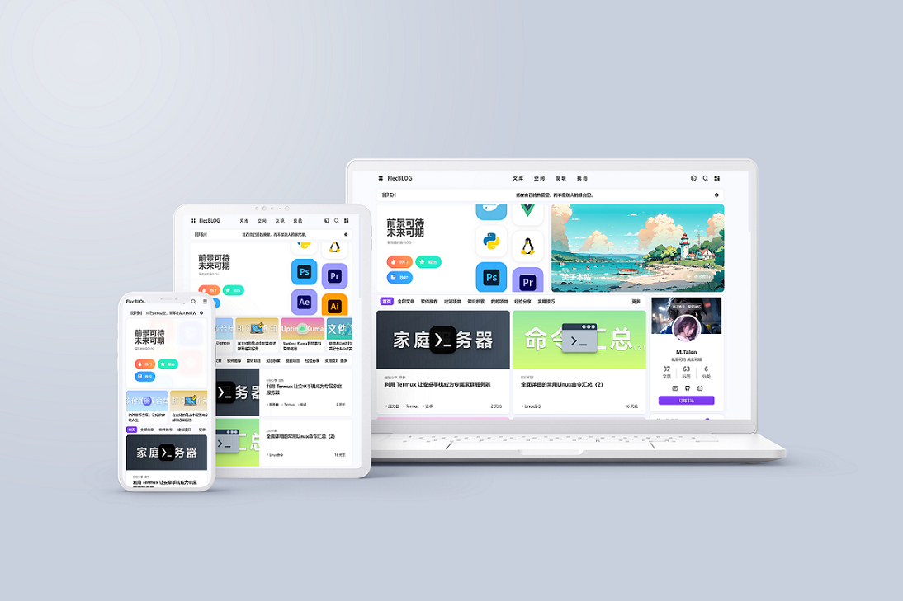

<div align="center">



一款简约但不简单的 Hexo 主题，精致写作，从这里开启。

</div>

## 特点

- 布局精巧：设计元素和谐统一，专注优质内容呈现。
- 功能灵活：多数功能可随心开启，满足多样需求。
- 多端适配：电脑手机皆适配，加载迅速，浏览顺滑。
- 个性十足：丰富设定助力塑造专属博客风格。
- 简约美观：整体风格简洁，视觉体验舒适自然。
- 代码优化：运行高效，减少资源占用，提升性能。
- 社交集成：方便整合社交链接，促进分享交流。
- 文章展示：排版清晰，利于读者沉浸式阅读文章。

## 安装

1. 使用 Git 克隆主题到本地。

```bash
git clone -b main https://github.com/talen8/hexo-theme-flecui.git themes/flecui
```

2. 应用主题。修改站点配置文件 `_config.yml`。

```yml
theme: flecui
```
